# Parallel Orchestrator Architecture

## System Overview

The Parallel Orchestrator is an intelligent system that uses AI to analyze requirements, creates N tasks, and executes them across multiple backends: Threading (local), Docker (containerized), SLURM (HPC), or AWS ParallelCluster (cloud HPC). The architecture supports horizontal scaling from a single machine to hundreds of compute nodes. All backends support AWS Bedrock for Claude AI inference.

## High-Level Architecture

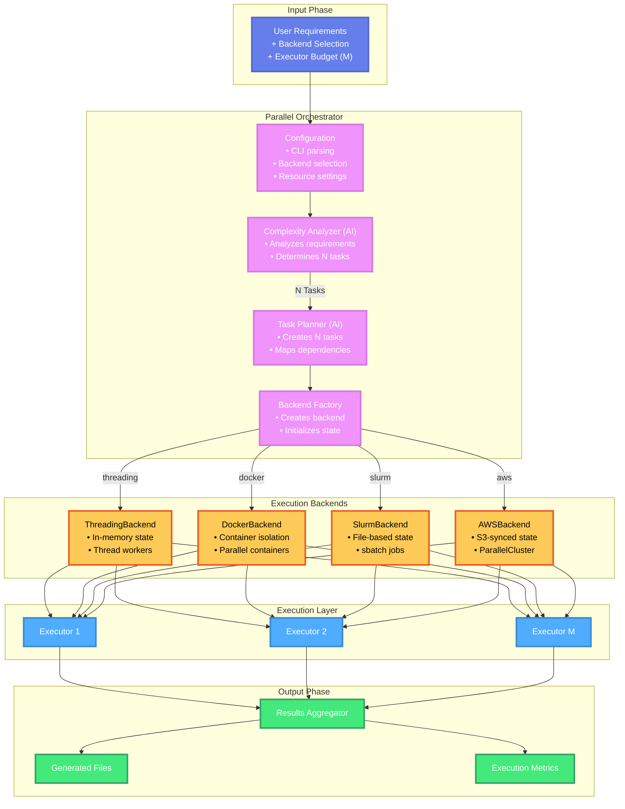

## Backend Architecture

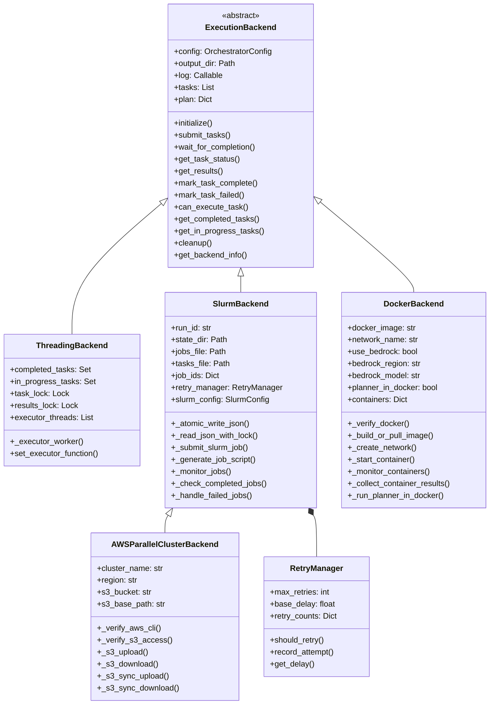

## Configuration Architecture

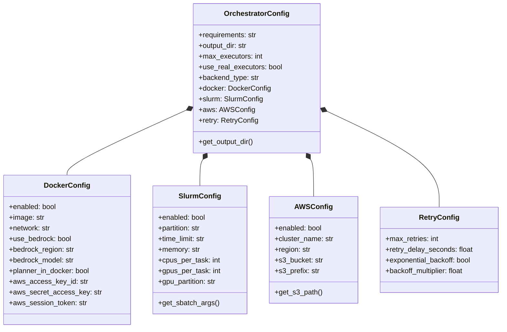

## Threading Backend Flow

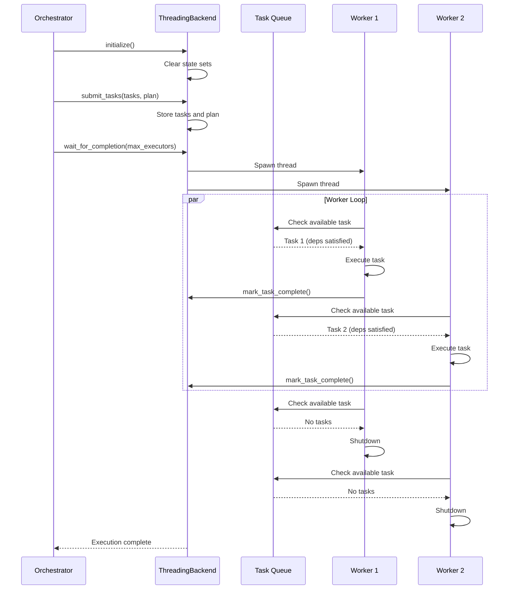

## Docker Backend Flow

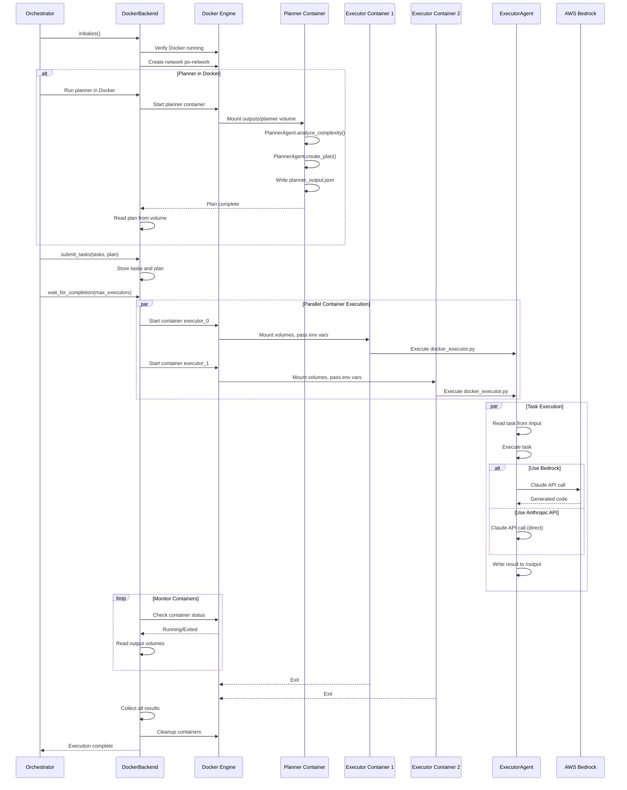

## SLURM Backend Flow

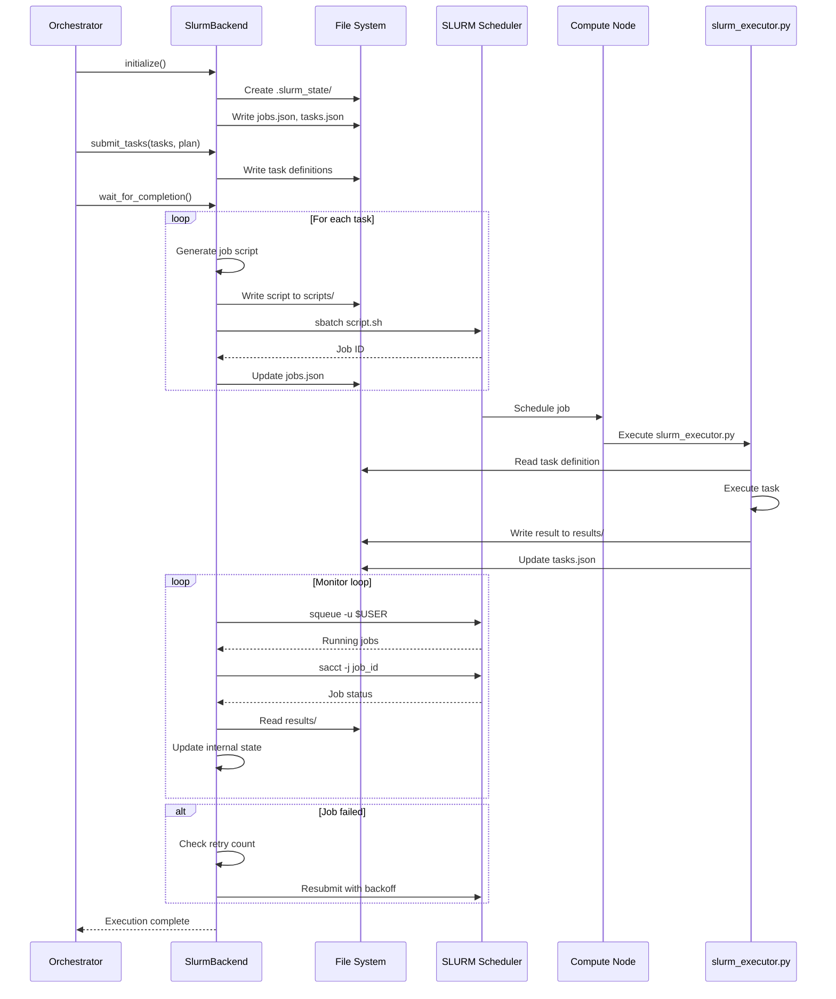

## AWS ParallelCluster Flow

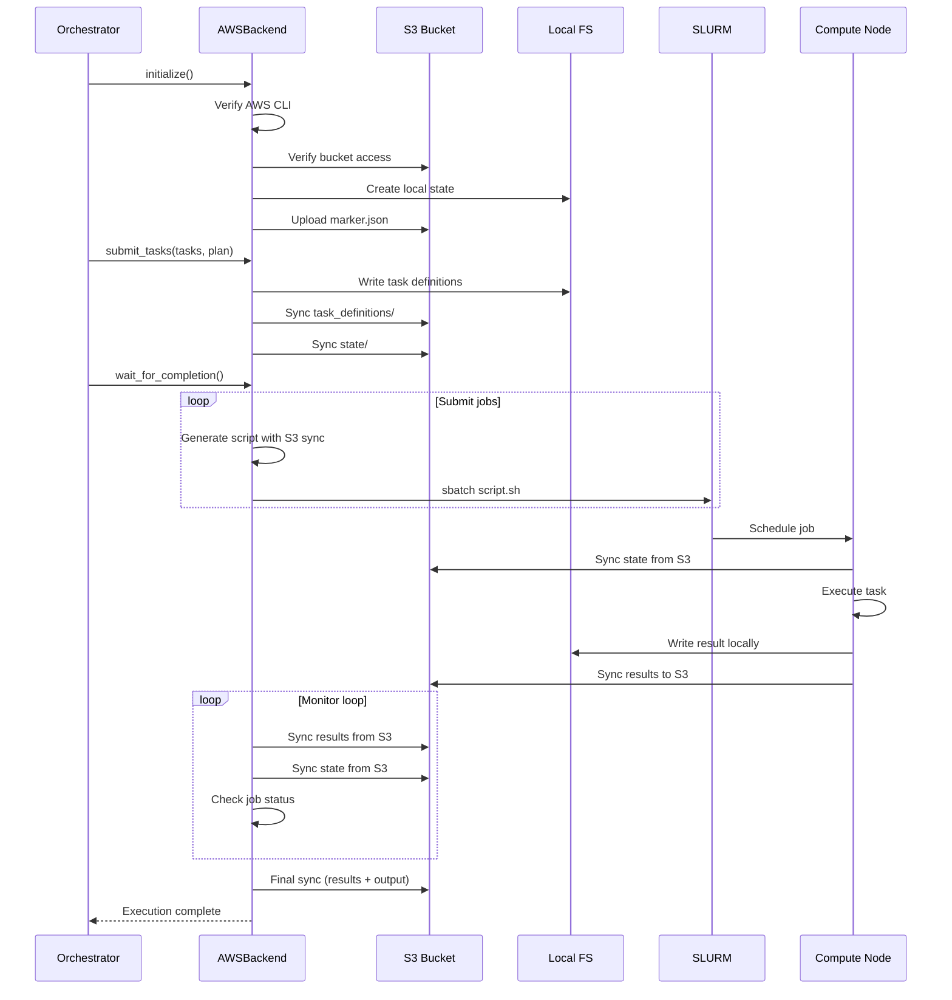

## State Management Comparison

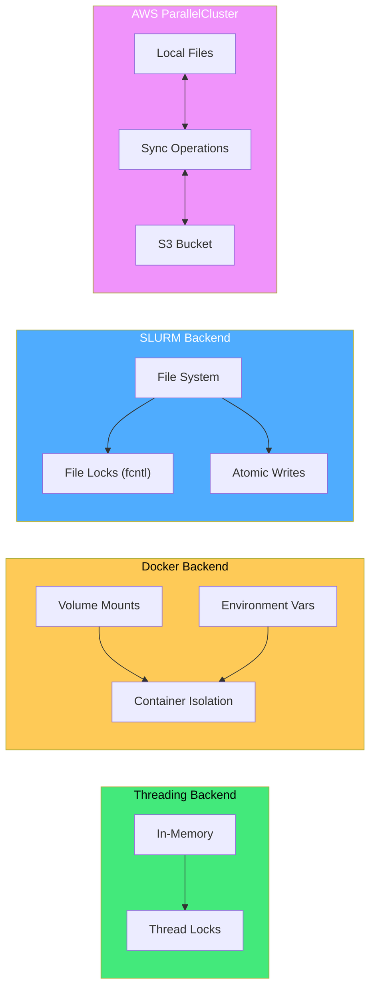

## SLURM Job Script Generation

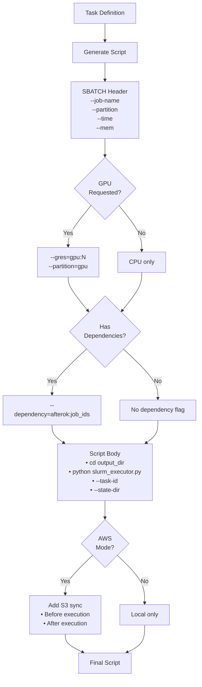

## Retry Logic Flow

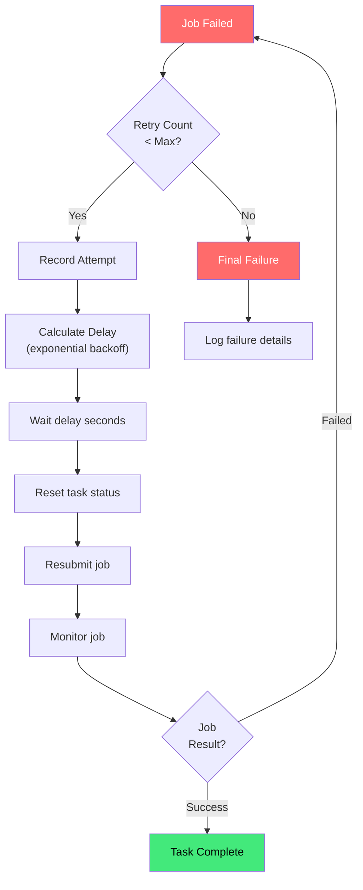

## Parallel Execution Timeline

```mermaid
gantt
    title Execution Timeline: 6 Tasks, 3 Workers
    dateFormat X
    axisFormat %L

    section Sequential Baseline
    Task 1 :0, 5
    Task 2 :5, 5
    Task 3 :10, 5
    Task 4 :15, 5
    Task 5 :20, 5
    Task 6 :25, 5

    section Threading (3 Workers)
    Worker 1 - Task 1 :0, 5
    Worker 1 - Task 4 :5, 5
    Worker 2 - Task 2 :0, 5
    Worker 2 - Task 5 :5, 5
    Worker 3 - Task 3 :0, 5
    Worker 3 - Task 6 :5, 5

    section SLURM (3 Jobs)
    Job 1 - Task 1 :0, 5
    Job 1 - Task 4 :5, 5
    Job 2 - Task 2 :0, 5
    Job 2 - Task 5 :5, 5
    Job 3 - Task 3 :0, 5
    Job 3 - Task 6 :5, 5
```

## Component Interaction

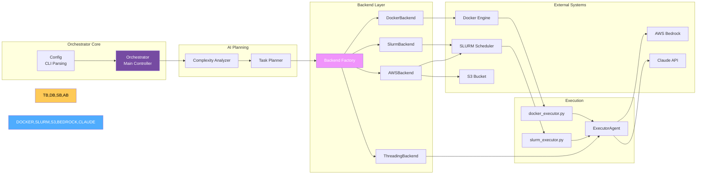

## Scaling Strategy

| Backend | Min Scale | Max Scale | State Sync | Best For |
|---------|-----------|-----------|------------|----------|
| **Threading** | 1 thread | ~20 threads | N/A (in-memory) | Local dev, testing |
| **Docker** | 1 container | ~50 containers | Volume mounts | Local parallel, isolation |
| **SLURM** | 1 job | 1000s jobs | File system | HPC clusters |
| **AWS ParallelCluster** | 1 node | 1000s nodes | S3 | Cloud HPC |

## File Structure

```
parallel-orchestrator/
├── orchestrator.py              # Main entry point
├── config.py                    # Configuration classes
├── planner_agent.py             # AI planning agent
├── executor_agent.py            # Task execution agent
├── docker_planner.py            # Docker planner script
├── docker_executor.py           # Docker executor script
├── slurm_executor.py            # SLURM node script
├── docker/                      # Docker image build
│   ├── Dockerfile               # Multi-stage container image
│   ├── build.sh                 # Build automation script
│   └── README.md                # Docker setup guide
└── backends/
    ├── __init__.py              # Exports
    ├── base.py                  # Abstract base
    ├── threading_backend.py     # Local threading
    ├── docker_backend.py        # Docker containers
    ├── slurm_backend.py         # SLURM HPC
    └── aws_parallel_cluster_backend.py  # AWS ParallelCluster
```

## Technology Stack

- **Python 3.9+**: Core implementation
- **Threading**: Local parallel execution
- **Docker**: Container isolation and parallel execution
- **Claude Code CLI**: AI code generation
- **AWS Bedrock**: Cloud AI inference (optional)
- **SLURM**: HPC job scheduling (sbatch, squeue, sacct)
- **AWS CLI**: S3 operations for cloud state
- **fcntl**: File locking for concurrent access
- **JSON**: Configuration and state storage

## Completed Features

1. ✅ Multi-backend architecture (Threading, Docker, SLURM, AWS ParallelCluster)
2. ✅ Docker backend with container isolation
3. ✅ Docker planner mode (planner runs in container)
4. ✅ AWS Bedrock integration (use AWS credentials instead of Anthropic API key)
5. ✅ GPU support with `--gres=gpu:N`
6. ✅ Auto-retry with exponential backoff
7. ✅ File-based state with atomic writes
8. ✅ S3 state synchronization for AWS backends
9. ✅ SLURM job dependency management
10. ✅ Configurable resource limits
11. ✅ Global and regional model support
12. ✅ Production-tested (100% success rate in real projects)

## Future Enhancements

1. **AWS Batch Backend**: Serverless batch job execution (planned)
2. **Kubernetes Backend**: Kubernetes-based execution
3. **Real-time Dashboard**: Web UI for monitoring
4. **Distributed Queue**: Redis/RabbitMQ integration
5. **Checkpoint/Resume**: Long-running job recovery
6. **Resource Estimation**: AI-based resource prediction
7. **Cost Optimization**: AWS Spot instance support

---

## Configuration Defaults

As of version 5.0, the following defaults are used:

- **Region**: `eu-central-1` (all AWS services)
- **Model**: `global.anthropic.claude-sonnet-4-5-20250929-v1:0` (works in all regions)
- **Max Executors**: 5 (configurable via `--max-executors`)
- **Docker Image**: `parallel-orchestrator:latest`
- **Docker Network**: `po-network`

## Real-World Performance

Based on production testing (January 2026):

| Metric | Result |
|--------|--------|
| **Success Rate** | 100% (10/10 tests) |
| **Avg Time per Project** | 3-4 minutes |
| **Files Generated** | 16-24 per project |
| **Lines of Code** | 5,000-10,000 per project |
| **Parallel Efficiency** | 3x speedup with 3 executors |

**Test Projects**:
- Contact form with validation (4 tasks, 16 files, 188s)
- Todo list app with local storage (6 tasks, 24 files, 195s)

## Related Documentation

- **[Main README](../README.md)** - Project overview and quick start
- **[Quick Start Guide](QUICKSTART.md)** - 5-minute setup guide
- **[Docker Backend](docker-backend.md)** - Docker execution details
- **[Docker with Bedrock](docker-bedrock-usage.md)** - AWS Bedrock setup
- **[Docker Planner](docker-planner.md)** - Planner containerization
- **[Bedrock Model Setup](bedrock-model-setup.md)** - Model configuration

---

**Last Updated:** January 2026
**Version:** 5.0 - Docker Backend with Bedrock Integration
