# Parallel Orchestrator Architecture

## System Overview

The Parallel Orchestrator is an intelligent system that uses AI to analyze requirements, creates N tasks, and spawns M executor workers (up to budget) that dynamically process tasks from a queue. The task queue model enables better parallelization where N tasks can exceed M executors.

## High-Level Architecture

```mermaid
graph TB
    subgraph Input["📝 Input Phase"]
        REQ["User Requirements<br/>+ Executor Budget (M)"]
    end

    subgraph Orchestrator["🎯 Parallel Orchestrator"]
        CA["1️⃣ Complexity Analyzer (AI)<br/>• Analyzes requirements<br/>• Determines optimal # of tasks<br/>• Returns N tasks to create"]
        TP["2️⃣ Task Planner (AI)<br/>• Creates N tasks<br/>• Maps dependencies<br/>• Assigns priorities & estimates"]
        TQ["📋 Task Queue<br/>• Tasks: [T1, T2, ..., TN]<br/>• Dependencies tracked<br/>• Available tasks ready"]
        PEM["3️⃣ Executor Manager<br/>• Spawns M worker threads<br/>• Workers pull from queue<br/>• Monitors progress"]
        RA["4️⃣ Results Aggregator<br/>• Collects outputs<br/>• Calculates metrics<br/>• Generates summary"]
    end

    subgraph Executors["⚡ Executor Workers (M workers for N tasks)"]
        E1["Executor 1<br/>→ Task 1<br/>→ Task 2<br/>→ ..."]
        E2["Executor 2<br/>→ Task 3<br/>→ Task 5<br/>→ ..."]
        E3["Executor 3<br/>→ Task 4<br/>→ Task 6<br/>→ ..."]
    end

    subgraph Output["📦 Output Phase"]
        FILES["Generated Files"]
        METRICS["Execution Metrics"]
        SUMMARY["Aggregated Summary"]
    end

    REQ --> CA
    CA -->|N Tasks| TP
    TP -->|Task Plan| TQ
    TQ -->|Queue| PEM

    PEM -.->|Worker Thread 1| E1
    PEM -.->|Worker Thread 2| E2
    PEM -.->|Worker Thread 3| E3

    E1 -.->|Pull Tasks| TQ
    E2 -.->|Pull Tasks| TQ
    E3 -.->|Pull Tasks| TQ

    E1 -->|Results| RA
    E2 -->|Results| RA
    E3 -->|Results| RA

    RA --> FILES
    RA --> METRICS
    RA --> SUMMARY

    classDef inputClass fill:#667eea,stroke:#5568d3,stroke-width:3px,color:#fff
    classDef orchestratorClass fill:#f093fb,stroke:#d678e8,stroke-width:3px,color:#fff
    classDef queueClass fill:#feca57,stroke:#ee5a24,stroke-width:3px,color:#000
    classDef executorClass fill:#4facfe,stroke:#3b8ccc,stroke-width:3px,color:#fff
    classDef outputClass fill:#43e97b,stroke:#38a169,stroke-width:3px,color:#fff

    class REQ inputClass
    class CA,TP,PEM,RA orchestratorClass
    class TQ queueClass
    class E1,E2,E3 executorClass
    class FILES,METRICS,SUMMARY outputClass
```



## Detailed Component Flow


## Complexity Analysis Flow (AI-Powered)

```mermaid
flowchart LR
    Start([Requirements<br/>+ Budget M]) --> AI[AI Analysis via<br/>Claude Code]

    AI --> Features{Analyze Features<br/>& Complexity}

    Features -->|Simple| T1[1-3 Tasks<br/>Few components]
    Features -->|Moderate| T2[3-8 Tasks<br/>Several components]
    Features -->|Complex| T3[8-15+ Tasks<br/>Many components]

    T1 --> Budget1{Check Budget}
    T2 --> Budget2{Check Budget}
    T3 --> Budget3{Check Budget}

    Budget1 -->|M executors| Exec1[Spawn min(1-3, M)<br/>workers]
    Budget2 -->|M executors| Exec2[Spawn min(3-8, M)<br/>workers]
    Budget3 -->|M executors| Exec3[Spawn min(8-15, M)<br/>workers]

    Exec1 --> Queue[Task Queue<br/>N tasks]
    Exec2 --> Queue
    Exec3 --> Queue

    Queue --> Workers[M Workers<br/>process N Tasks<br/>dynamically]

    Workers --> End([Execute Plan])

    style Start fill:#667eea,color:#fff
    style AI fill:#f093fb,color:#fff
    style Queue fill:#feca57,color:#000
    style Workers fill:#4facfe,color:#fff
    style End fill:#43e97b,color:#fff
    style T1,T2,T3 fill:#ff9ff3,color:#000
```

## Task Planning Strategy (Task Queue Model)

```mermaid
graph TD
    subgraph "Simple Project: 1-3 Tasks"
        T1["Task 1: Complete Implementation<br/>• All features in one task<br/>• Single responsibility"]
    end

    subgraph "Moderate Project: 3-8 Tasks (Example: 6 tasks, 3 workers)"
        T2A["Task 1: Database Schema<br/>• Schema design<br/>• Models<br/>• Migrations"]
        T2B["Task 2: Backend API<br/>• CRUD endpoints<br/>• Business logic<br/>• Depends on Task 1"]
        T2C["Task 3: Frontend Setup<br/>• Project structure<br/>• Routing<br/>• No dependencies"]
        T2D["Task 4: UI Components<br/>• Forms & Lists<br/>• Styling<br/>• Depends on Task 3"]
        T2E["Task 5: API Integration<br/>• Connect UI to API<br/>• State mgmt<br/>• Depends on Task 2, 4"]
        T2F["Task 6: Testing<br/>• Unit & E2E tests<br/>• Polish<br/>• Depends on Task 5"]
    end

    subgraph "Complex Project: 8-15+ Tasks (Example: 12 tasks, 5 workers)"
        T3A["Task 1: DB Schema"]
        T3B["Task 2: User API"]
        T3C["Task 3: Product API"]
        T3D["Task 4: Order API"]
        T3E["Task 5: Auth Service"]
        T3F["Task 6: Frontend Core"]
        T3G["Task 7: User UI"]
        T3H["Task 8: Product UI"]
        T3I["Task 9: Cart UI"]
        T3J["Task 10: Integration"]
        T3K["Task 11: Unit Tests"]
        T3L["Task 12: E2E Tests"]
    end

    subgraph "Execution Model"
        Queue["📋 Task Queue<br/>All N tasks"]
        Workers["⚡ M Worker Threads<br/>Pull tasks dynamically"]
        Queue --> Workers
    end

    style T1 fill:#43e97b,color:#000
    style T2A,T2B,T2C,T2D,T2E,T2F fill:#4facfe,color:#fff
    style T3A,T3B,T3C,T3D,T3E,T3F,T3G,T3H,T3I,T3J,T3K,T3L fill:#667eea,color:#fff
    style Queue fill:#feca57,color:#000
    style Workers fill:#f093fb,color:#fff
```



## Parallel Execution Model (Task Queue)


**Time Comparison:**
- **Sequential**: 6 tasks × 5 time units = 30 time units
- **Task Queue (3 workers)**: max(Worker-1: 10, Worker-2: 20, Worker-3: 0) = 20 time units
- **Speed Improvement**: 1.5x faster (automatic load balancing)
- **Key Benefit**: Worker-2 handled 4 tasks while Worker-1 handled 2 tasks - automatic distribution!

## Data Flow (Task Queue Model)

```mermaid
flowchart TD
    REQ[User Requirements<br/>+ Budget M] --> ORCH{Orchestrator}

    ORCH --> |1. Analyze via AI| COMPLEXITY[AI determines<br/>N tasks to create]
    COMPLEXITY --> |2. Plan via AI| PLAN[Execution Plan<br/>N tasks + dependencies]
    PLAN --> |3. Initialize| QUEUE[📋 Task Queue<br/>N tasks ready]
    QUEUE --> |4. Spawn| EXEC{Executor Manager<br/>Spawn M workers}

    EXEC --> |spawn worker| E1[Worker 1]
    EXEC --> |spawn worker| E2[Worker 2]
    EXEC --> |spawn worker| E3[Worker 3]

    E1 -.-> |pull tasks| QUEUE
    E2 -.-> |pull tasks| QUEUE
    E3 -.-> |pull tasks| QUEUE

    QUEUE -.-> |Task available| E1
    QUEUE -.-> |Task available| E2
    QUEUE -.-> |Task available| E3

    E1 --> |results| R1[Files + Metrics<br/>Multiple tasks]
    E2 --> |results| R2[Files + Metrics<br/>Multiple tasks]
    E3 --> |results| R3[Files + Metrics<br/>Multiple tasks]

    R1 --> AGG[Results Aggregator]
    R2 --> AGG
    R3 --> AGG

    AGG --> SUMMARY[Final Summary<br/>✓ N Tasks completed<br/>✓ M Workers used<br/>✓ Success rate<br/>✓ Files created<br/>✓ Lines of code<br/>✓ Test coverage]

    style REQ fill:#667eea,color:#fff
    style COMPLEXITY fill:#f093fb,color:#fff
    style PLAN fill:#f093fb,color:#fff
    style QUEUE fill:#feca57,color:#000
    style E1,E2,E3 fill:#4facfe,color:#fff
    style SUMMARY fill:#43e97b,color:#000
```



## System States (Task Queue Model)


## Component Interaction (Task Queue Model)

```mermaid
graph LR
    subgraph "Orchestrator Core"
        O[Orchestrator<br/>Main Controller<br/>Budget: M]
    end

    subgraph "AI Planning Module (PlannerAgent)"
        CA[Complexity Analyzer<br/>• AI via Claude Code<br/>• Determines N tasks<br/>• Budget-aware]
        TP[Task Planner<br/>• AI via Claude Code<br/>• Creates N tasks<br/>• Maps dependencies]
    end

    subgraph "Task Queue System"
        TQ[Task Queue<br/>• N tasks ready<br/>• Dependency tracking<br/>• Thread-safe access]
    end

    subgraph "Execution Module"
        EM[Executor Manager<br/>• Spawns M workers<br/>• Progress monitoring<br/>• Resource management]

        E1[Worker 1<br/>Pull → Execute → Repeat]
        E2[Worker 2<br/>Pull → Execute → Repeat]
        E3[Worker 3<br/>Pull → Execute → Repeat]
    end

    subgraph "Aggregation Module"
        RA[Results Aggregator<br/>• Output collection<br/>• Metrics calculation<br/>• Summary generation]
    end

    subgraph "Storage"
        LOG[Logs]
        FILES[Output Files<br/>executor_M/task_N/]
        JSON[JSON Reports<br/>Plan + Summary]
    end

    O --> CA
    CA -->|N tasks| TP
    TP -->|Task plan| TQ
    TQ --> EM

    EM -.->|Spawn| E1
    EM -.->|Spawn| E2
    EM -.->|Spawn| E3

    E1 <-.->|Pull tasks| TQ
    E2 <-.->|Pull tasks| TQ
    E3 <-.->|Pull tasks| TQ

    E1 --> RA
    E2 --> RA
    E3 --> RA

    RA --> LOG
    RA --> FILES
    RA --> JSON

    O -.-> LOG

    style O fill:#764ba2,color:#fff
    style CA,TP fill:#f093fb,color:#fff
    style TQ fill:#feca57,color:#000
    style EM,RA fill:#f093fb,color:#fff
    style E1,E2,E3 fill:#4facfe,color:#fff
    style LOG,FILES,JSON fill:#43e97b,color:#000
```



## Scaling Strategy (Task Queue Model)

| Project Type | Tasks Created (N) | Workers Spawned (M) | Execution Model | Example |
|-------------|-------------------|---------------------|-----------------|---------|
| **Simple** | 1-3 | min(1-3, Budget) | Few tasks, few workers | "Create calculator" → 1 task, 1 worker |
| **Moderate** | 3-8 | min(3-8, Budget) | More tasks than workers possible | "Todo app" → 6 tasks, 3 workers (Budget=3) |
| **Complex** | 8-15 | min(8-15, Budget) | Fine-grained tasks | "E-commerce" → 12 tasks, 5 workers (Budget=5) |
| **Enterprise** | 15+ | min(15+, Budget) | Many fine-grained tasks | "Platform" → 20 tasks, 10 workers (Budget=10) |

**Key Insight**: Tasks (N) are not limited by Budget (M). The AI can create more tasks than executors for better parallelization!

## Performance Metrics


## Key Features

### 🧠 AI-Powered Intelligent Planning
- AI-powered complexity analysis via Claude Code
- Determines optimal number of tasks to create (N)
- Budget-aware resource allocation (M workers)
- Domain-agnostic task breakdown

### ⚡ Task Queue Execution Model
- M executor workers process N tasks dynamically
- N tasks can exceed M budget for better parallelization
- Automatic load balancing (fast workers handle more tasks)
- Dependency-aware execution
- Thread-based parallelism with thread-safe operations

### 📊 Comprehensive Metrics
- Success rate tracking
- Code metrics (LOC, coverage)
- Execution time analysis
- Tasks per executor distribution

### 🔄 Robust Error Handling
- Per-worker error isolation
- Graceful shutdown when queue empty
- Detailed error reporting
- Task-level failure tracking

## Technology Stack

- **Python 3.x**: Core implementation
- **Threading**: Parallel execution
- **JSON**: Plan and result storage
- **Subprocess**: Claude API integration
- **Pathlib**: File system operations

## Completed Features ✅

1. ✅ **Dynamic Dependency Management**: Tasks wait for prerequisites automatically
2. ✅ **Automatic Load Balancing**: Workers pick tasks dynamically from queue
3. ✅ **Task Queue Model**: M workers process N tasks (N can be > M)
4. ✅ **AI-Powered Planning**: Claude Code determines optimal task breakdown
5. ✅ **Thread-Safe Operations**: Proper locks for concurrent access

## Future Enhancements

1. **Cloud Deployment**: Scale across multiple machines
2. **Real-time Dashboard**: Web UI for monitoring task queue and workers
3. **Quality Scoring**: Evaluate output quality automatically
4. **Auto-retry Logic**: Retry failed tasks with exponential backoff
5. **Resource Limits**: CPU and memory constraints per worker
6. **Dynamic Priority**: Adjust task priorities based on dependencies and urgency
7. **Task Estimation**: Use AI to estimate task duration more accurately
8. **Distributed Queue**: Support for distributed task queues (Redis, RabbitMQ)

## Conclusion

The Parallel Orchestrator provides an intelligent, AI-powered solution for complex task execution using a task queue model. By leveraging Claude Code to analyze requirements and determine the optimal number of tasks (N), then spawning M executor workers (based on budget) that dynamically process tasks from a queue, it achieves:

- **Better Parallelization**: Can create more tasks than executors for fine-grained work distribution
- **Automatic Load Balancing**: Fast workers naturally handle more tasks
- **Dependency Management**: Tasks wait for prerequisites automatically
- **Resource Efficiency**: Only spawn workers needed, never more than budget
- **Significant Performance**: Up to Mx faster than sequential execution

The system combines AI-powered planning with efficient task queue execution to deliver consistent, high-quality results while maintaining simplicity and ease of use.
