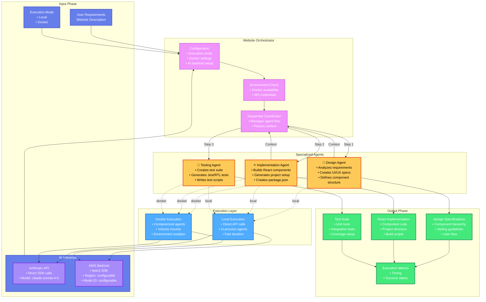
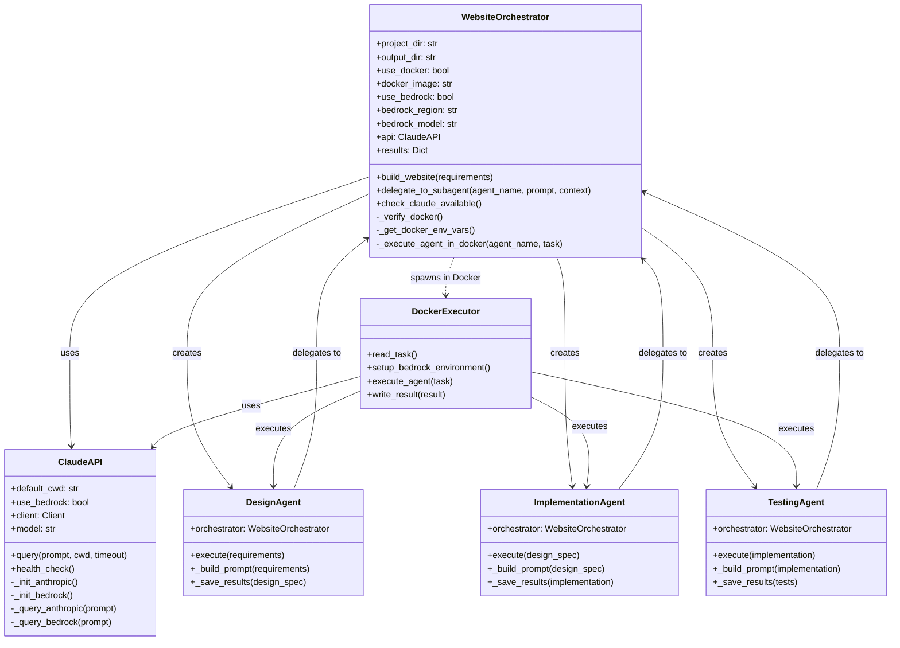
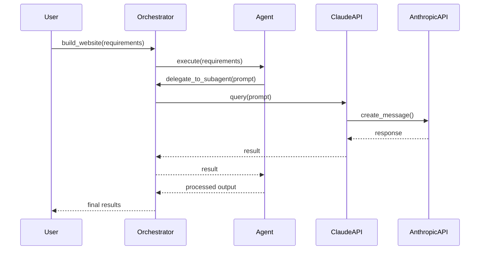
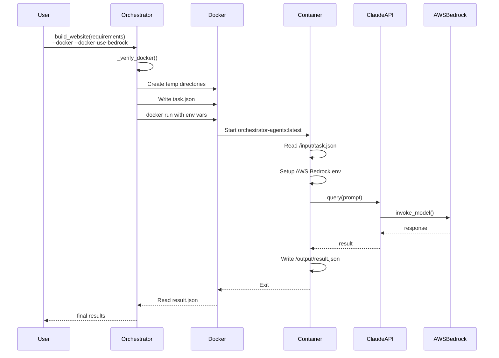
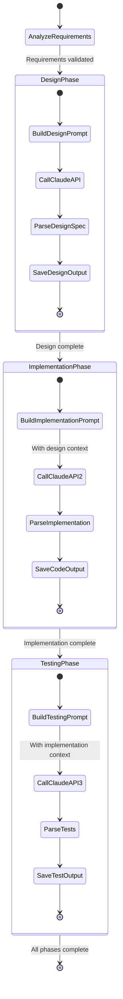
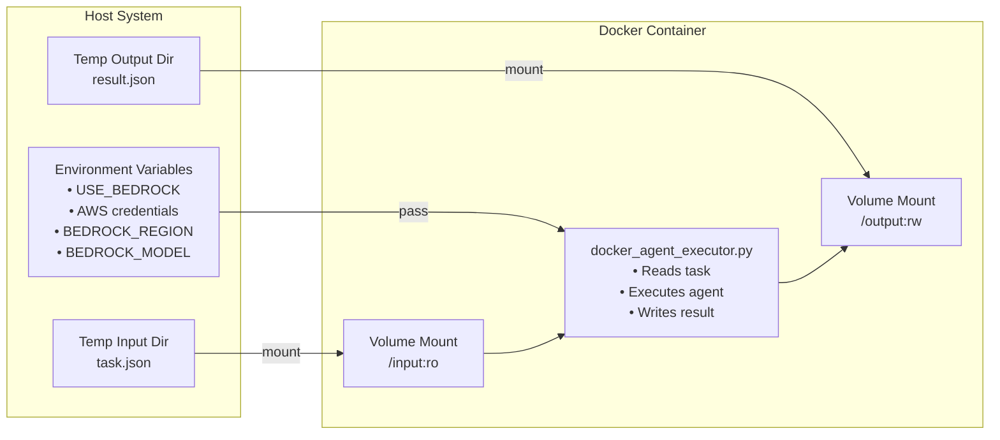

# Website Orchestrator Architecture

## System Overview

The Website Orchestrator is an intelligent system that coordinates three specialized AI agents to build complete websites. It analyzes requirements, creates design specifications, implements React components, and generates test suites. The architecture supports both local and Docker execution modes with AI inference via Anthropic API or AWS Bedrock.

## High-Level Architecture



## Component Architecture



## Execution Modes

### Local Execution Mode



### Docker Execution Mode



## Agent Workflow



## Docker Infrastructure

### Image Structure

```
orchestrator-agents:latest
├── Ubuntu 22.04 base
├── Python 3.10
├── System packages
│   ├── curl
│   ├── git
│   └── build tools
├── Python SDKs
│   ├── anthropic==0.76.0
│   └── boto3==1.42.34
├── Agent files
│   ├── design_agent.py
│   ├── implementation_agent.py
│   ├── testing_agent.py
│   ├── claude_api.py
│   └── docker_agent_executor.py
└── Directories
    ├── /workspace (working directory)
    ├── /input (task definition, read-only)
    └── /output (results, read-write)
```

### Container Communication



## Data Flow

### Task Definition (Input)

```json
{
  "agent": "design|implementation|testing",
  "prompt": "Detailed prompt for the agent",
  "context": {
    "requirements": "User requirements",
    "previous_results": "Context from previous agents"
  }
}
```

### Result Format (Output)

```json
{
  "success": true,
  "agent": "design",
  "output": "Agent-specific output (design spec, code, tests)",
  "metadata": {
    "timestamp": "2025-01-26T00:00:00Z",
    "execution_time": 45.2,
    "model": "claude-sonnet-4-5-20250929"
  },
  "error": null
}
```

## Configuration

### CLI Parameters

| Parameter | Default | Description |
|-----------|---------|-------------|
| `requirements` | (required) | Website requirements description |
| `--project-dir` | current dir | Project directory |
| `--output-dir` | ../outputs/website-orchestrator | Output directory |
| `--docker` | false | Enable Docker execution |
| `--docker-image` | orchestrator-agents:latest | Docker image |
| `--docker-use-bedrock` | false | Use AWS Bedrock |
| `--docker-bedrock-region` | eu-central-1 | AWS region |
| `--docker-bedrock-model` | global.anthropic...v1:0 | Bedrock model ID |

### Environment Variables

#### Anthropic API Mode
- `ANTHROPIC_API_KEY` - API key for Anthropic API

#### AWS Bedrock Mode
- `USE_BEDROCK=1` - Enable Bedrock mode
- `AWS_ACCESS_KEY_ID` - AWS access key
- `AWS_SECRET_ACCESS_KEY` - AWS secret key
- `AWS_SESSION_TOKEN` - (Optional) AWS session token
- `BEDROCK_REGION` - AWS region
- `BEDROCK_MODEL` - Bedrock model ID

## Output Structure

```
outputs/website-orchestrator/
├── design/
│   ├── design_spec.md          # Design specifications
│   └── design_phase.json       # Raw design output
├── implementation/
│   ├── components/             # React components
│   ├── styles/                 # CSS/styling files
│   ├── package.json            # Project dependencies
│   ├── setup_instructions.md   # Setup guide
│   └── implementation_phase.json
├── testing/
│   ├── tests/                  # Test files
│   ├── test_plan.md           # Testing strategy
│   └── testing_phase.json
└── orchestration_report.json   # Overall execution metrics
```

## Key Features

### 1. Sequential Agent Coordination
- **Design → Implementation → Testing** flow
- Each agent receives context from previous agents
- Ensures coherent output across all phases

### 2. Dual Execution Modes
- **Local Mode**: Fast iteration, direct API calls
- **Docker Mode**: Isolated execution, reproducible environments

### 3. Flexible AI Backend
- **Anthropic API**: Direct Claude access
- **AWS Bedrock**: Enterprise-grade inference with AWS infrastructure

### 4. Context Passing
- Design specs inform implementation
- Implementation code informs test generation
- Full traceability across phases

### 5. Robust Error Handling
- Environment validation before execution
- Docker availability checks
- API credential verification
- Graceful failure with detailed error messages

## Comparison with Parallel Orchestrator

| Feature | Website Orchestrator | Parallel Orchestrator |
|---------|---------------------|---------------------|
| **Execution Pattern** | Sequential (3 fixed agents) | Parallel (N dynamic tasks) |
| **Task Planning** | Pre-defined workflow | AI-generated task plan |
| **Agent Types** | Specialized (Design/Impl/Test) | Generic executor agents |
| **Backends** | Local, Docker | Threading, Docker, SLURM, AWS |
| **Use Case** | Website development | General parallel tasks |
| **Complexity** | Lower (fixed workflow) | Higher (dynamic planning) |
| **Scalability** | 3 agents max | Up to M executors |
| **State Management** | In-memory | Backend-specific (file/S3) |

## Best Practices

### Local Development
```bash
# Quick iteration with local execution
python build_website.py "Build a todo app"
```

### Production Docker
```bash
# Isolated, reproducible builds
python build_website.py "Build a dashboard" \
    --docker \
    --docker-use-bedrock \
    --output-dir ./production-output
```

### Custom Docker Image
```bash
# Build custom image with additional tools
cd orchestrator/docker
./build.sh

# Use custom image
python build_website.py "Build e-commerce site" \
    --docker \
    --docker-image my-custom-orchestrator:v1
```

## Future Enhancements

1. **Parallel Agent Execution**: Run design and testing in parallel with implementation
2. **Additional Backends**: Support SLURM/AWS ParallelCluster for multi-node scaling
3. **Agent Plugins**: Allow custom agent types to be registered
4. **Streaming Output**: Real-time progress updates during agent execution
5. **Caching**: Cache agent responses for repeated requirements
6. **Multi-Model Support**: Allow different models for different agents
