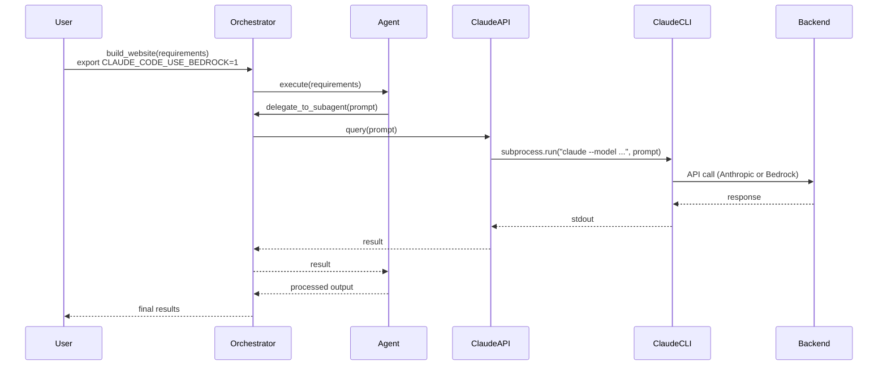

# Website Orchestrator Architecture

## System Overview

The Website Orchestrator is an intelligent system that coordinates three specialized AI agents to build complete websites. It analyzes requirements, creates design specifications, implements React components, and generates test suites. The architecture supports three execution modes: Claude CLI (local), Docker (containerized), and direct SDK calls, with AI inference via Anthropic API or AWS Bedrock.

## High-Level Architecture

```mermaid
graph TB
    subgraph Input["Input Phase"]
        REQ["User Requirements<br/>Website Description"]
        MODE["Execution Mode<br/>• CLI (Local)<br/>• Docker<br/>• SDK Direct"]
        AI["AI Backend<br/>• Claude CLI<br/>• Anthropic API<br/>• AWS Bedrock"]
    end

    subgraph Orchestrator["Website Orchestrator"]
        CONFIG["Configuration<br/>• Execution mode<br/>• Docker settings<br/>• AI backend setup"]
        VERIFY["Environment Check<br/>• Docker availability<br/>• API credentials"]
        SEQ["Sequential Coordinator<br/>• Manages agent flow<br/>• Passes context"]
    end

    subgraph Agents["Specialized Agents"]
        DESIGN["🎨 Design Agent<br/>• Analyzes requirements<br/>• Creates UI/UX specs<br/>• Defines component structure"]
        IMPL["⚛️ Implementation Agent<br/>• Builds React components<br/>• Generates project setup<br/>• Creates package.json"]
        TEST["🧪 Testing Agent<br/>• Creates test suite<br/>• Generates Jest/RTL tests<br/>• Writes test scripts"]
    end

    subgraph Execution["Execution Layer"]
        CLI["CLI Execution<br/>• Claude CLI subprocess<br/>• Local agents<br/>• Fast iteration<br/>• Bedrock support"]
        DOCKER["Docker Execution<br/>• Containerized agents<br/>• Volume mounts<br/>• Environment isolation"]
        SDK["SDK Execution<br/>• Direct API calls<br/>• Python SDK<br/>• Fallback mode"]
    end

    subgraph AI["AI Inference"]
        ANTHROPIC["Anthropic API<br/>• Direct SDK calls<br/>• Model: claude-sonnet-4-5"]
        BEDROCK["AWS Bedrock<br/>• boto3 SDK<br/>• Region: configurable<br/>• Model ID: configurable"]
    end

    subgraph Output["Output Phase"]
        DESIGN_OUT["Design Specifications<br/>• Component hierarchy<br/>• Styling guidelines<br/>• User flow"]
        CODE_OUT["React Implementation<br/>• Component code<br/>• Project structure<br/>• Build scripts"]
        TEST_OUT["Test Suite<br/>• Unit tests<br/>• Integration tests<br/>• Coverage setup"]
        METRICS["Execution Metrics<br/>• Timing<br/>• Success status"]
    end

    REQ --> CONFIG
    MODE --> CONFIG
    AI --> CONFIG
    CONFIG --> VERIFY
    VERIFY --> SEQ

    SEQ -->|Step 1| DESIGN
    DESIGN -->|Context| SEQ
    SEQ -->|Step 2| IMPL
    IMPL -->|Context| SEQ
    SEQ -->|Step 3| TEST

    DESIGN -.->|cli| CLI
    IMPL -.->|cli| CLI
    TEST -.->|cli| CLI

    DESIGN -.->|docker| DOCKER
    IMPL -.->|docker| DOCKER
    TEST -.->|docker| DOCKER

    DESIGN -.->|sdk| SDK
    IMPL -.->|sdk| SDK
    TEST -.->|sdk| SDK

    CLI --> ANTHROPIC
    CLI --> BEDROCK
    DOCKER --> ANTHROPIC
    DOCKER --> BEDROCK
    SDK --> ANTHROPIC
    SDK --> BEDROCK

    DESIGN --> DESIGN_OUT
    IMPL --> CODE_OUT
    TEST --> TEST_OUT

    DESIGN_OUT --> METRICS
    CODE_OUT --> METRICS
    TEST_OUT --> METRICS

    classDef inputClass fill:#667eea,stroke:#5568d3,stroke-width:3px,color:#fff
    classDef orchestratorClass fill:#f093fb,stroke:#d678e8,stroke-width:3px,color:#fff
    classDef agentClass fill:#feca57,stroke:#ee5a24,stroke-width:3px,color:#000
    classDef executionClass fill:#4facfe,stroke:#3b8ccc,stroke-width:3px,color:#fff
    classDef aiClass fill:#a78bfa,stroke:#7c3aed,stroke-width:3px,color:#fff
    classDef outputClass fill:#43e97b,stroke:#38a169,stroke-width:3px,color:#fff

    class REQ,MODE,AI inputClass
    class CONFIG,VERIFY,SEQ orchestratorClass
    class DESIGN,IMPL,TEST agentClass
    class LOCAL,DOCKER executionClass
    class ANTHROPIC,BEDROCK aiClass
    class DESIGN_OUT,CODE_OUT,TEST_OUT,METRICS outputClass
```



## Component Architecture


## Execution Modes

### CLI Execution Mode (Default)

Executes agents using Claude CLI as a subprocess, supporting both Anthropic API and AWS Bedrock.



**Advantages:**
- Fast iteration with minimal overhead
- Unified interface for both Anthropic and Bedrock
- Automatic model selection via environment variables
- Works with existing Claude CLI configuration

**Use Cases:**
- Local development
- Rapid prototyping
- Testing with different AI backends
- Personal projects

### SDK Execution Mode (Fallback)

Direct API calls using Python SDKs when Claude CLI is not available.


**Advantages:**
- No external dependencies (CLI not required)
- Direct control over API parameters
- Simpler error handling

**Use Cases:**
- Environments without Claude CLI
- Programmatic integration
- CI/CD pipelines without CLI

### Docker Execution Mode


## Agent Workflow


## Docker Infrastructure

### Image Structure

```
orchestrator-agents:latest
├── Ubuntu 22.04 base
├── Python 3.10
├── System packages
│   ├── curl
│   ├── git
│   └── build tools
├── Python SDKs
│   ├── anthropic==0.76.0
│   └── boto3==1.42.34
├── Agent files
│   ├── design_agent.py
│   ├── implementation_agent.py
│   ├── testing_agent.py
│   ├── claude_api.py
│   └── docker_agent_executor.py
└── Directories
    ├── /workspace (working directory)
    ├── /input (task definition, read-only)
    └── /output (results, read-write)
```

### Container Communication

```mermaid
graph LR
    subgraph Host["Host System"]
        TEMP_IN["Temp Input Dir<br/>task.json"]
        TEMP_OUT["Temp Output Dir<br/>result.json"]
        ENV["Environment Variables<br/>• USE_BEDROCK<br/>• AWS credentials<br/>• BEDROCK_REGION<br/>• BEDROCK_MODEL"]
    end

    subgraph Container["Docker Container"]
        VOL_IN["Volume Mount<br/>/input:ro"]
        VOL_OUT["Volume Mount<br/>/output:rw"]
        EXEC["docker_agent_executor.py<br/>• Reads task<br/>• Executes agent<br/>• Writes result"]
    end

    TEMP_IN -->|mount| VOL_IN
    TEMP_OUT -->|mount| VOL_OUT
    ENV -->|pass| EXEC
    VOL_IN --> EXEC
    EXEC --> VOL_OUT
```



## Data Flow

### Task Definition (Input)

```json
{
  "agent": "design|implementation|testing",
  "prompt": "Detailed prompt for the agent",
  "context": {
    "requirements": "User requirements",
    "previous_results": "Context from previous agents"
  }
}
```

### Result Format (Output)

```json
{
  "success": true,
  "agent": "design",
  "output": "Agent-specific output (design spec, code, tests)",
  "metadata": {
    "timestamp": "2025-01-26T00:00:00Z",
    "execution_time": 45.2,
    "model": "claude-sonnet-4-5-20250929"
  },
  "error": null
}
```

## Configuration

### CLI Parameters

| Parameter | Default | Description |
|-----------|---------|-------------|
| `requirements` | (required) | Website requirements description |
| `--project-dir` | current dir | Project directory |
| `--output-dir` | ../outputs/website-orchestrator | Output directory |
| `--docker` | false | Enable Docker execution |
| `--docker-image` | orchestrator-agents:latest | Docker image |
| `--docker-use-bedrock` | false | Use AWS Bedrock |
| `--docker-bedrock-region` | eu-central-1 | AWS region |
| `--docker-bedrock-model` | global.anthropic...v1:0 | Bedrock model ID |

### Environment Variables

#### CLI Mode with Bedrock (Recommended)
- `CLAUDE_CODE_USE_BEDROCK=1` - Enable Bedrock via Claude CLI
- `BEDROCK_MODEL` - Bedrock model ID (e.g., `global.anthropic.claude-sonnet-4-5-20250929-v1:0`)
- `AWS_ACCESS_KEY_ID` - AWS access key
- `AWS_SECRET_ACCESS_KEY` - AWS secret key
- `AWS_SESSION_TOKEN` - (Optional) AWS session token

#### CLI Mode with Anthropic API
- `ANTHROPIC_API_KEY` - (Optional) API key override for Claude CLI

#### SDK Mode - Anthropic API
- `ANTHROPIC_API_KEY` - API key for Anthropic API

#### SDK Mode - AWS Bedrock (Docker)
- `USE_BEDROCK=1` - Enable Bedrock mode (SDK)
- `AWS_ACCESS_KEY_ID` - AWS access key
- `AWS_SECRET_ACCESS_KEY` - AWS secret key
- `AWS_SESSION_TOKEN` - (Optional) AWS session token
- `BEDROCK_REGION` - AWS region
- `BEDROCK_MODEL` - Bedrock model ID

## Output Structure

```
outputs/website-orchestrator/
├── design/
│   ├── design_spec.md          # Design specifications
│   └── design_phase.json       # Raw design output
├── implementation/
│   ├── components/             # React components
│   ├── styles/                 # CSS/styling files
│   ├── package.json            # Project dependencies
│   ├── setup_instructions.md   # Setup guide
│   └── implementation_phase.json
├── testing/
│   ├── tests/                  # Test files
│   ├── test_plan.md           # Testing strategy
│   └── testing_phase.json
└── orchestration_report.json   # Overall execution metrics
```

## Key Features

### 1. Sequential Agent Coordination
- **Design → Implementation → Testing** flow
- Each agent receives context from previous agents
- Ensures coherent output across all phases

### 2. Three Execution Modes
- **CLI Mode**: Claude CLI subprocess execution, supports both Anthropic and Bedrock
- **Docker Mode**: Containerized agents with environment isolation
- **SDK Mode**: Direct API calls via Python SDKs (fallback)

### 3. Flexible AI Backend
- **Claude CLI**: Unified interface for Anthropic API and AWS Bedrock
- **Anthropic API**: Direct Claude access via SDK
- **AWS Bedrock**: Enterprise-grade inference with AWS infrastructure

### 4. Context Passing
- Design specs inform implementation
- Implementation code informs test generation
- Full traceability across phases

### 5. Robust Error Handling
- Environment validation before execution
- Docker availability checks
- API credential verification
- Graceful failure with detailed error messages

## Comparison with Parallel Orchestrator

| Feature | Website Orchestrator | Parallel Orchestrator |
|---------|---------------------|---------------------|
| **Execution Pattern** | Sequential (3 fixed agents) | Parallel (N dynamic tasks) |
| **Task Planning** | Pre-defined workflow | AI-generated task plan |
| **Agent Types** | Specialized (Design/Impl/Test) | Generic executor agents |
| **Backends** | Local, Docker | Threading, Docker, SLURM, AWS |
| **Use Case** | Website development | General parallel tasks |
| **Complexity** | Lower (fixed workflow) | Higher (dynamic planning) |
| **Scalability** | 3 agents max | Up to M executors |
| **State Management** | In-memory | Backend-specific (file/S3) |

## Best Practices

### Local Development
```bash
# Quick iteration with local execution
python build_website.py "Build a todo app"
```

### Production Docker
```bash
# Isolated, reproducible builds
python build_website.py "Build a dashboard" \
    --docker \
    --docker-use-bedrock \
    --output-dir ./production-output
```

### Custom Docker Image
```bash
# Build custom image with additional tools
cd orchestrator/docker
./build.sh

# Use custom image
python build_website.py "Build e-commerce site" \
    --docker \
    --docker-image my-custom-orchestrator:v1
```

## Future Enhancements

1. **Parallel Agent Execution**: Run design and testing in parallel with implementation
2. **Additional Backends**: Support SLURM/AWS ParallelCluster for multi-node scaling
3. **Agent Plugins**: Allow custom agent types to be registered
4. **Streaming Output**: Real-time progress updates during agent execution
5. **Caching**: Cache agent responses for repeated requirements
6. **Multi-Model Support**: Allow different models for different agents
